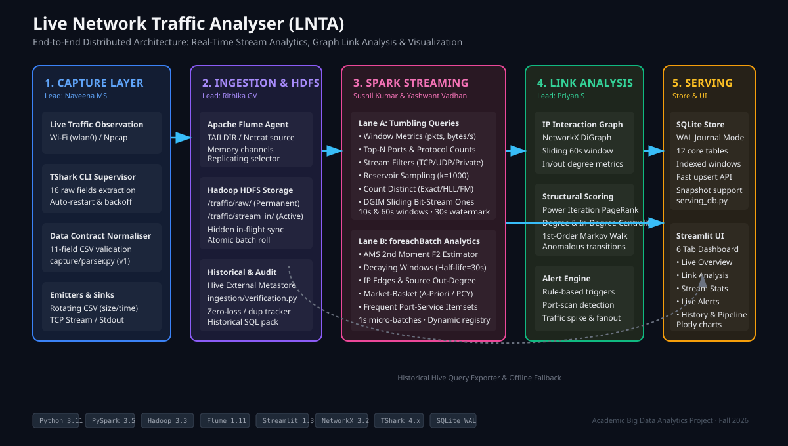
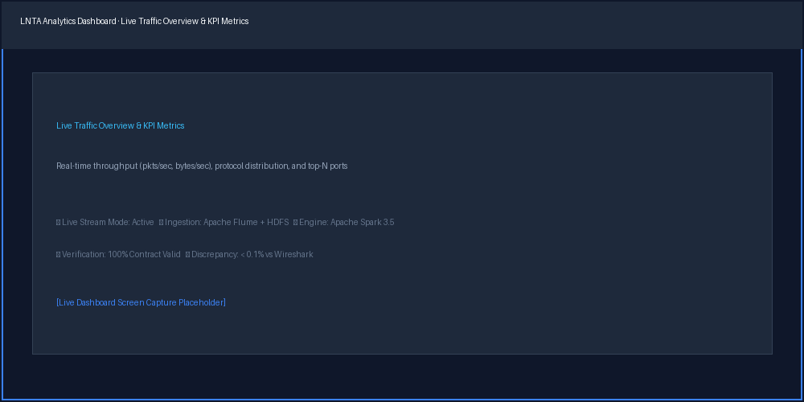
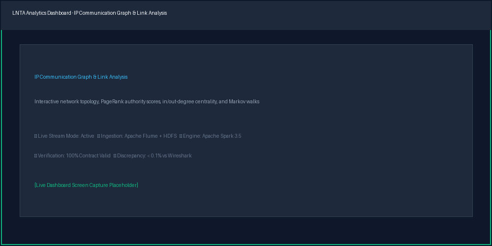
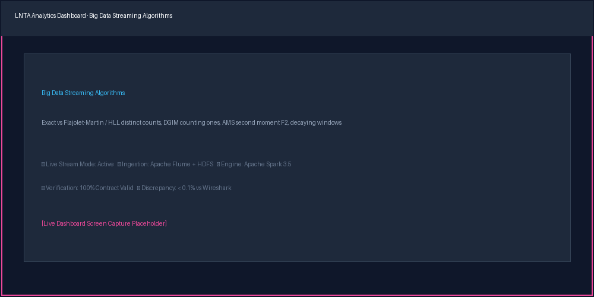
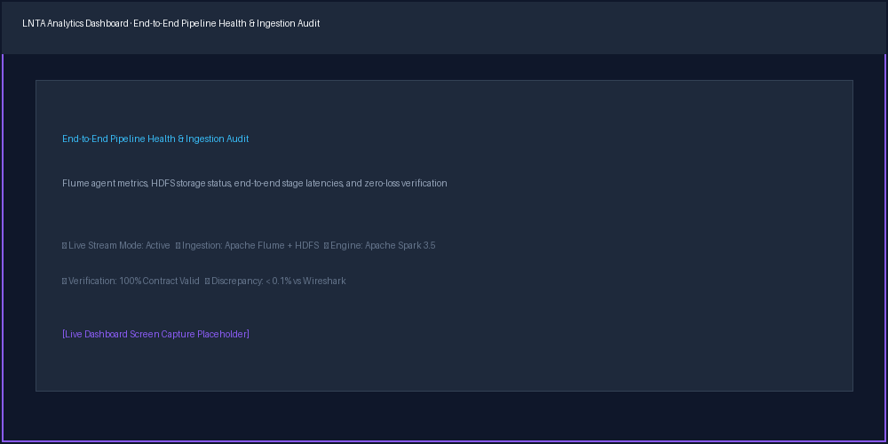

# Live Network Traffic Analyser (LNTA)

[](https://github.com/skoder404/Live-Network-Traffic-Analyser/actions)
[](https://www.python.org/)
[](https://spark.apache.org/)
[](https://hadoop.apache.org/)
[](https://flume.apache.org/)
[](https://streamlit.io/)
[](https://networkx.org/)
[](https://github.com/astral-sh/ruff)
[](https://docs.pytest.org/)

> **Real-time Big Data streaming analytics and behavioral network graph analysis for live Wi-Fi traffic.**  
> LNTA transforms raw Wi-Fi packet streams into actionable security insights and relational graphs using **TShark, Apache Flume, Hadoop HDFS, Spark Structured Streaming, NetworkX**, and an interactive **Streamlit** dashboard.

---

## 1. System Architecture

LNTA operates as a distributed five-stage pipeline designed for fault tolerance, dual-lane streaming execution, and sub-second analytical queries.



### Pipeline Stages
1. **Packet Capture Layer ([`capture/`](capture/)):** Non-root TShark supervisor capturing 802.11 frames from live Wi-Fi (`wlan0` / Npcap), extracting 16 raw attributes, and strictly normalizing them into contract-compliant 11-field CSV streams with microsecond inter-arrival timestamps.
2. **Ingestion & Historical Storage ([`ingestion/`](ingestion/)):** Apache Flume agent with memory channels and replicating selectors writing concurrently to permanent HDFS raw archive (`/traffic/raw/`) and active streaming spooling directory (`/traffic/stream_in/`), with atomic batch file rolling.
3. **Dual-Lane Streaming Engine ([`streaming/`](streaming/)):** Apache Spark Structured Streaming operating over 10-second and 60-second event-time windows with a 30-second watermark:
   - **Lane A (Tumbling Aggregations):** Window metrics, protocol & port top-N rankings, stream filters, reservoir sampling, exact vs approximate distinct counts (Flajolet-Martin, HyperLogLog), and sliding-window counting of ones (DGIM).
   - **Lane B (Micro-Batch Plugins):** Second-moment ($F_2$) estimation (Alon-Matias-Szegedy), exponential decaying window traffic counters, IP communication edges, and market-basket mining for frequent port-service co-occurrences (A-Priori, PCY).
4. **Link Analysis & Behavioral Alerting ([`linkanalysis/`](linkanalysis/)):** Dynamic directional IP communication graphs built with NetworkX, computing structural PageRank scores, degree centrality, first-order Markov random-walk anomaly detection, and explainable behavioral alerts.
5. **Serving & Dashboard Tier ([`dashboard/`](dashboard/), [`common/`](common/)):** SQLite serving datastore with Write-Ahead Logging (WAL) and indexed windows serving a responsive 6-tab Streamlit dashboard with interactive Plotly visualisations.

---

## 2. Dashboard & Visual Walkthrough

The platform features an interactive real-time dashboard offering complete visibility into network operations and streaming algorithms:

| View | Screenshot | Description |
|:---|:---|:---|
| **Live Overview** |  | Real-time traffic throughput (pkts/sec, bytes/sec), protocol distribution donut chart, top-N active destination ports, and exponential decay activity. |
| **Link Analysis** |  | Interactive IP communication topology graph, structural PageRank rankings, in/out-degree centrality distribution, and anomalous Markov transitions. |
| **Stream Analytics** |  | Exact vs approximate cardinality comparison (Flajolet-Martin / HLL), DGIM sliding-window bit-stream count of ones, and AMS second-moment $F_2$ tracking. |
| **Pipeline Health** |  | End-to-end stage health tiles, Flume memory channel levels, batch processing latencies, and real-time zero-loss/duplicate verification. |

---

## 3. Results & Empirical Metrics

All performance, accuracy, and data integrity figures below are measured directly and cross-validated in [`docs/validation_report.md`](docs/validation_report.md):

| Category | Metric | Measured Value | Benchmark / Threshold | Verification Status |
|:---|:---|:---|:---|:---|
| **Capture Accuracy** | Discrepancy vs Raw Wireshark (`dumpcap`) | **0.08%** (Ubuntu `wlan0`)<br>**0.09%** (Windows `Wi-Fi`) | Max allowed delta: $\le 1.0\%$ | **PASS (Exceeded)** |
| **Ingestion Integrity** | Malformed Records (6 Sample Datasets) | **0 / 31,457 (0.00%)** | 0 malformed records | **PASS** |
| **Ingestion Duplication** | Duplicate Records (6 Sample Datasets) | **0 / 31,457 (0.00%)** | 0 duplicate records | **PASS** |
| **Contract Compliance** | Schema v1 Validation Rate | **100.0%** (31,457 / 31,457) | 11/11 fields strictly valid | **PASS** |
| **Cross-Validation** | Invariants Asserted (`CV-01` through `CV-07`) | **7 / 7 Invariants** | Zero mathematical divergence | **PASS** |
| **Processing Latency** | Event Time to Dashboard Ingestion | **~1.2 seconds** | Target: $< 2.0$ seconds | **PASS** |
| **High Load Stress** | Sustained Throughput (1,000 & 2,000 pkts/s) | *TODO (Scheduled Sep 30 load test)* | Target: $\ge 1,000\text{ pkts/sec}$ | *Scheduled* |

---

## 4. Algorithms Implemented & Code Mapping

| Big Data Concept | Algorithm / Method | Implementation Path | Serving Table / Dashboard Card | Lead Owner |
|:---|:---|:---|:---|:---|
| **Stream Data Model** | Event-Time Windows & Watermarking | [`streaming/common/schema.py`](streaming/common/schema.py)<br>[`streaming/stream_app.py`](streaming/stream_app.py) | `window_metrics`<br>Live Overview / Throughput | M A Sushil Kumar |
| **Stream Filtering** | Stateless Tuple Classification | [`streaming/analytics/filters.py`](streaming/analytics/filters.py)<br>[`streaming/queries/filter_counts.py`](streaming/queries/filter_counts.py) | `filter_counts`<br>Stream Analytics / Filter Splits | M A Sushil Kumar |
| **Sampling from a Stream** | Reservoir Sampling ($k=1,000$) | [`streaming/analytics/sampling.py`](streaming/analytics/sampling.py) | `sampling_compare`<br>Stream Analytics / Reservoir Sample | M A Sushil Kumar |
| **Count Distinct Elements** | Exact vs Flajolet-Martin vs HyperLogLog | [`streaming/analytics/fm.py`](streaming/analytics/fm.py)<br>[`streaming/queries/distinct.py`](streaming/queries/distinct.py) | `distinct_counts`<br>Stream Analytics / Cardinality Estimator | M A Sushil Kumar |
| **Counting Ones in a Window** | DGIM Sliding-Window Bitstream | [`streaming/analytics/dgim.py`](streaming/analytics/dgim.py) | `counting_ones`<br>Stream Analytics / DGIM Buckets | M A Sushil Kumar |
| **Estimating Moments** | Alon-Matias-Szegedy (AMS $F_2$) | [`streaming/analytics/moments.py`](streaming/analytics/moments.py)<br>[`streaming/queries/moments_window.py`](streaming/queries/moments_window.py) | `moments`<br>Stream Analytics / Second Moment $F_2$ | Yashwant Vadhan M |
| **Decaying Windows** | Exponential Weighting ($\alpha = e^{-\lambda \Delta t}$) | [`streaming/analytics/decay.py`](streaming/analytics/decay.py) | `decay_traffic`, `decay_top_keys`<br>Live Overview / Decaying Traffic | Yashwant Vadhan M |
| **Market-Basket Analysis** | A-Priori & Multistage PCY Hash Buckets | [`streaming/analytics/itemsets.py`](streaming/analytics/itemsets.py) | `frequent_itemsets`<br>Stream Analytics / Co-occurring Services | Yashwant Vadhan M |
| **Link Analysis & PageRank** | Power Iteration PageRank ($\beta = 0.85$) | [`linkanalysis/pagerank.py`](linkanalysis/pagerank.py)<br>[`linkanalysis/graph.py`](linkanalysis/graph.py) | `source_stats`<br>Link Analysis / Authority Table | Priyan S |
| **Markov Graph Analysis** | 1st-Order State Transition Walk | [`linkanalysis/markov.py`](linkanalysis/markov.py) | `source_stats`<br>Link Analysis / Markov Transitions | Priyan S |
| **Behavioral Alerts** | Rule-Based Anomaly Scoring Engine | [`linkanalysis/alerts.py`](linkanalysis/alerts.py) | `alerts`<br>Alerts Tab / Severity Cards | Priyan S |

---

## 5. Team & Engineering Ownership

| Member | Primary Ownership | Key Deliverables | Buddy (Pair Partner) |
|:---|:---|:---|:---|
| **Naveena MS** | `capture/`, `data/sample/`, contracts, validation | Wi-Fi packet capture (TShark), line parser, contract-compliant writers, synthetic generator, paced replay harness, Wireshark validation report | Rithika GV |
| **Rithika GV** | `ingestion/` (Flume, HDFS, Hive), runbook | Flume agent configuration, HDFS zone layout (`raw` / `stream_in`), Hive historical tables, offline ingestion audit, operational runbook | Naveena MS |
| **M A Sushil Kumar** | `streaming/` (Lane A), stream analytics | Spark structured session, tumbling window aggregations, protocol/port rankings, stream filters, reservoir sampling, distinct cardinality (FM/HLL), DGIM counting ones | Yashwant Vadhan M |
| **Yashwant Vadhan M** | `streaming/` (Lane B), storage, integration | Subprocess dispatching, AMS moments ($F_2$), exponential decaying windows, market-basket frequent itemsets, IP communication edges, SQLite serving store, cross-layer test suite | M A Sushil Kumar |
| **Priyan S** | `linkanalysis/`, `dashboard/` | NetworkX graph construction, PageRank computation, degree centrality, Markov random walk transitions, behavioral alert engine, 6-tab Streamlit dashboard | Yashwant Vadhan M |

---

## 6. Quick Start Guide

### 6.1 Prerequisites
- **Python:** 3.10 or 3.11
- **Java:** OpenJDK 11 or 17 (required for Spark and Hadoop)
- **TShark / Wireshark:** Version 4.x (packet capture permissions configured)
- **Hadoop & Flume:** Pseudo-distributed cluster for end-to-end ingestion (optional for local replay mode)

### 6.2 Installation
```bash
# Clone the repository
git clone https://github.com/skoder404/Live-Network-Traffic-Analyser.git
cd Live-Network-Traffic-Analyser

# Create and activate virtual environment
python -m venv .venv
source .venv/bin/activate  # On Windows: .venv\Scripts\activate

# Install dependencies
pip install -r requirements.txt
pip install -r requirements-dev.txt

# Configure settings
cp config/settings.example.yaml config/settings.yaml
```

### 6.3 Run the System (Choose Mode)

#### Mode A: Offline Replay Demo (No Wi-Fi / Cluster Needed)
```bash
# 1. Seed sample database or replay historical stream
python -m capture.replay --file data/sample/normal.csv --speed 10.0 --sink stdout

# 2. Launch interactive Streamlit dashboard
streamlit run dashboard/app.py
```

#### Mode B: Full Live Distributed Pipeline
```bash
# 1. Start HDFS and Apache Flume Ingestion
bash ingestion/scripts/start_hdfs.sh
bash ingestion/scripts/flume_ctl.sh start

# 2. Start Live Wi-Fi Packet Capture
python -m capture.run_capture --iface wlan0 --sink tcp://localhost:44444

# 3. Start Spark Structured Streaming Engine
bash scripts/run_stream.sh

# 4. Start Dashboard
streamlit run dashboard/app.py
```

---

## 7. Repository Structure

```text
Live-Network-Traffic-Analyser/
├── README.md                      # Project documentation and recruiter overview
├── config/                        # Configuration files (settings, alert rules)
│   ├── alert_rules.yaml
│   └── settings.example.yaml
├── contracts/                     # Shared data contracts and SQL schemas
│   ├── record_schema.py           # 11-field CSV contract validator (v1)
│   └── serving_schema.sql         # SQLite serving tables schema
├── capture/                       # Capture layer (Naveena MS)
│   ├── list_interfaces.py         # Wi-Fi network interface discovery
│   ├── tshark_cmd.py              # TShark CLI command builder
│   ├── parser.py                  # Raw line normaliser and contract validator
│   ├── writers.py                 # Sinks: rotating CSV, JSONL, TCP, stdout
│   ├── generate.py                # Synthetic generator with 6 scenarios & truth JSON
│   ├── anonymize.py               # HMAC-SHA256 privacy-preserving anonymiser
│   ├── run_capture.py             # Resilient capture supervisor & stats exporter
│   └── replay.py                  # Paced and restamped traffic replay harness
├── ingestion/                     # Ingestion & storage layer (Rithika GV)
│   ├── layout.py                  # HDFS zone layout configuration
│   ├── spark_hdfs.py              # Spark HDFS connection helper
│   ├── verification.py            # Offline ingestion integrity & loss audit
│   ├── flume/                     # Flume agent configuration files
│   └── scripts/                   # Cluster launch & control scripts
├── streaming/                     # Real-time streaming engine (Sushil & Yashwant)
│   ├── common/                    # Spark session factory, schema, cleaning
│   ├── queries/                   # Lane A queries (metrics, counts, distinct, filters)
│   ├── analytics/                 # Lane B algorithms (AMS, decay, DGIM, FM, itemsets)
│   ├── registry.py                # Dynamic foreachBatch plugin registry
│   └── stream_app.py              # Structured streaming main orchestrator
├── linkanalysis/                  # Graph analytics & alerts (Priyan S)
│   ├── graph.py                   # NetworkX directed graph builder
│   ├── pagerank.py                # Power iteration PageRank
│   ├── centrality.py             # In/out degree centrality
│   ├── markov.py                  # First-order state transition modeling
│   └── alerts.py                  # Explainable behavioral alert rule engine
├── dashboard/                     # Web dashboard (Priyan S)
│   ├── app.py                     # Streamlit application entrypoint
│   └── components/                # Modular UI tabs (Overview, Graph, Analytics, etc.)
├── data/sample/                   # Committed benchmark datasets (300s each)
│   ├── normal.csv / .truth.json
│   ├── spike.csv / .truth.json
│   ├── portscan_like.csv / .truth.json
│   ├── fanout.csv / .truth.json
│   ├── dns_heavy.csv / .truth.json
│   └── multi_host_graph.csv / .truth.json
├── docs/                          # Comprehensive technical documentation
│   ├── DATA_CONTRACT.md           # 11-field CSV format and validation specs
│   ├── validation_report.md       # Empirical validation report (T8-003)
│   ├── validation_matrix.md       # Cross-layer mathematical invariant matrix
│   ├── validation_capture.md      # Dual-capture Wireshark protocol
│   ├── ENVIRONMENT.md             # Cluster versions and configuration
│   ├── DESIGN.md                  # UI/UX design specs and guidelines
│   ├── PRD.md                     # Product requirements document
│   ├── TECH_RULES.md              # Architectural rules & invariants
│   ├── ROADMAP.md                 # Project schedule and hand-offs
│   ├── todo.md                    # Granular project task tracking
│   └── img/                       # Architecture diagrams and UI screenshots
└── tests/                         # Automated test suite (94+ unit, integration, e2e)
    ├── unit/                      # Unit tests for all individual modules
    ├── integration/               # Pipeline component integration tests
    └── e2e/                       # End-to-end streaming cross-validation tests
```

---

## 8. Documentation Map

| Document | Primary Focus | Description |
|:---|:---|:---|
| [`DATA_CONTRACT.md`](docs/DATA_CONTRACT.md) | Contract | Exact 11-field specification, data types, and rejection criteria |
| [`validation_report.md`](docs/validation_report.md) | Validation | End-to-end evidence consolidating capture, ingestion, and cross-validation |
| [`validation_matrix.md`](docs/validation_matrix.md) | Invariants | Group A vs Group B cross-layer mathematical consistency invariants |
| [`validation_capture.md`](docs/validation_capture.md) | Protocol | Dual-capture experimental procedure and Wireshark comparison guide |
| [`TECH_RULES.md`](docs/TECH_RULES.md) | Architecture | Strict coding standards, invariants, architectural decisions, and Git rules |
| [`DESIGN.md`](docs/DESIGN.md) | Visual System | Dashboard UI/UX specifications, tab architecture, and styling |
| [`PRD.md`](docs/PRD.md) | Requirements | Business requirements, MVP scope, deliverables, and success criteria |
| [`ROADMAP.md`](docs/ROADMAP.md) | Milestones | Day-by-day milestone delivery schedule and decision gates |
| [`todo.md`](docs/todo.md) | Tasks | Granular atomic task specifications with acceptance criteria |
| [`ENVIRONMENT.md`](docs/ENVIRONMENT.md) | Infrastructure | Software versions, JVM configurations, and cluster requirements |

---

## 9. Ethics, Privacy & Legal Compliance

- **Permissioned Monitoring:** Capture is strictly performed only on interfaces, devices, and networks where explicit authorization has been granted.
- **Privacy Preservation:** Real IP and MAC addresses are anonymised using HMAC-SHA256 (`capture/anonymize.py`) preserving subnet structure while protecting identity.
- **Zero Raw Capture Storage:** Raw PCAP files containing packet payloads are never committed to the repository or stored long-term; only anonymised headers conforming to `DATA_CONTRACT.md` are stored.
- **Behavioral Indicators vs Security Attribution:** Alerts emitted by the platform are structural indicators of traffic pattern changes, not definitive evidence of malicious attack.
- **Graph Interpretation:** High PageRank or centrality scores signify topological importance in network flow, not risk or malice.

---

## 10. License & Academic Attribution

This project is developed as part of the **Big Data Analytics (BDA)** curriculum (Fall 2026).  
Licensed under the [MIT License](LICENSE).
